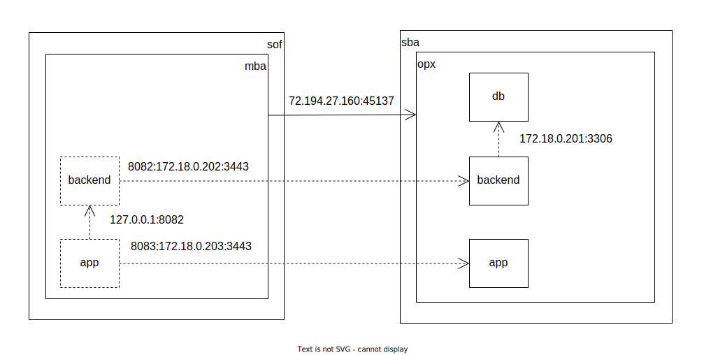

# Test IDB and MySQL

## Summary

Demonstrate sync between remote (MySQL) and local (IDB) databases in the contect of unreliable network.

Unreliable network:
- no network connectivity
- unreachable backend
- bad network quality (drops, jitter)
- slow network (latency, throughput)

## Workspace



## Decrypt live certificates
```
openssl enc -aes-128-cbc -pbkdf2 -salt -d -in ~/ws-archive/certs.tar.gz.bin | tar xzv --directory ./
```

## Run the database
```
docker container run --rm \
  --name test-db \
  --network bridge-sba-opx \
  --ip 172.18.0.201 \
  --volume "$PWD/mysql:/var/lib/mysql" \
  --env MYSQL_ROOT_PASSWORD=LikeBeingThere \
  -d mysql

mysql_config_editor set --host=172.18.0.201 --port=3306 --user=root --password

mysql < db/schema.sql 
mysql < db/data.sql 
```

## Run the backend
```
npm install --prefix backend

docker container run --rm \
  --name test-backend \
  --network bridge-sba-opx \
  --ip 172.18.0.202 \
  --user node \
  --workdir /home/node/backend \
  --volume "$PWD/backend:/home/node/backend" \
  --volume "$PWD/certs:/home/node/certs" \
  -d node index

curl https://172-18-0-202.spamfro.xyz:3443/api/v1/users

curl https://172-18-0-202.spamfro.xyz:3443/api/v1/users/1

curl https://172-18-0-202.spamfro.xyz:3443/api/v1/users/1 -X DELETE

curl https://172-18-0-202.spamfro.xyz:3443/api/v1/users -H 'Content-Type: application/json' -d '{"email":"alice@acme.com","full_name":"Alice Henderson"}'
curl https://172-18-0-202.spamfro.xyz:3443/api/v1/users -H 'Content-Type: application/json' -d '{"full_name":"Alice Henderson"}'
curl https://172-18-0-202.spamfro.xyz:3443/api/v1/users -H 'Content-Type: application/json' -d '{"full_name":"Alice Henderson}'
curl https://172-18-0-202.spamfro.xyz:3443/api/v1/users -H 'Content-Type: application/json' -d '{"full_name":"Alice Henderson"}'

curl https://172-18-0-202.spamfro.xyz:3443/api/v1/users/27 -H 'Content-Type: application/json' -d '{"full_name":"Alice Wonderland"}' -X PUT
curl https://172-18-0-202.spamfro.xyz:3443/api/v1/users/27 -H 'Content-Type: application/json' -d '{}' -X PUT
curl https://172-18-0-202.spamfro.xyz:3443/api/v1/users -H 'Content-Type: application/json' -d '{}' -X PUT
```

## Run the app
```
npm install --prefix app

docker container run --rm \
  --name test-app \
  --network bridge-sba-opx \
  --ip 172.18.0.203 \
  --user node \
  --workdir /home/node/app \
  --volume "$PWD/app:/home/node/app" \
  --volume "$PWD/certs:/home/node/certs" \
  -d node npx http-server ./ -c-1 --ssl -p 3443 --cert ../certs/cert.pem --key ../certs/cert-key-nopassword.pem

curl https://172-18-0-203.spamfro.xyz:3443
```

## Run the app on MBA
```
ssh -L 8082:172.18.0.202:3443 opx
curl https://spamfro.xyz:8082/api/v1/users

ssh -L 8083:172.18.0.203:3443 opx
curl https://spamfro.xyz:8083/
```
